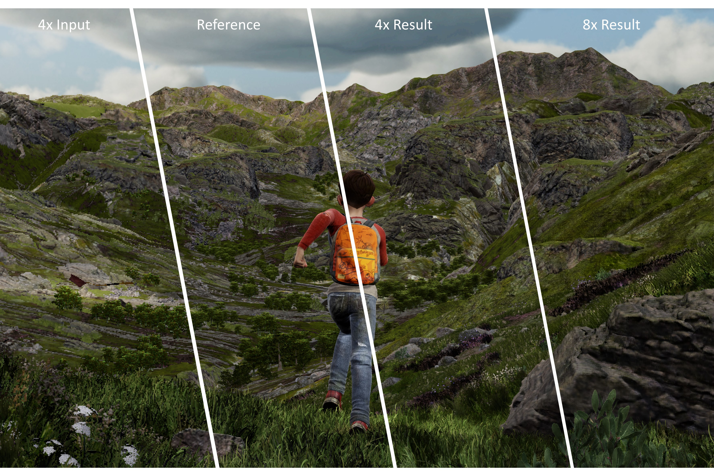

# FuseSR: Super Resolution for Real-time Rendering through Efficient Multi-resolution Fusion 
### [Project Page](https://isaac-paradox.github.io/FuseSR/) | [Paper](https://arxiv.org/abs/2310.09726) | [Supplementary](https://drive.google.com/file/d/1UO0vPEakHvXMltCcBSuwgPjrY1ITI5j7/view?usp=share_link) | [Video](https://drive.google.com/file/d/1wSPdfpwOkOIznQUqUZdBMmdQ3WAWlhms/view?usp=share_link)

Welcome to the official GitHub repository for the paper entitled "FuseSR: Super Resolution for Real-time Rendering through Efficient Multi-resolution Fusion", presented at SIGGRAPH ASIA 2023. 

 

## Introduction 

This repository contains the code, datasets, models, and additional resources used in our work. We propose a novel technique for real-time super-resolution, known as FuseSR, that leverages efficient multi-resolution fusion mechanisms. Our method advances the field of computer graphics and rendering by providing high-resolution outputs without a noticeable hit to performance. 

## Table of Contents 

1. [Paper Abstract](#paper-abstract) 
2. [Setup](#setup) 
3. [Quickstart](#quickstart)
4. [Citation](#citation) 

## Paper Abstract 

The workload of real-time rendering is steeply increasing as the demand for high resolution, high refresh rates, and high realism rises, overwhelming most graphics cards. To mitigate this problem, one of the most popular solutions is to render images at a low resolution to reduce rendering overhead, and then manage to accurately upsample the low-resolution rendered image to the target resolution, a.k.a. super-resolution techniques. Most existing methods focus on exploiting information from low-resolution inputs, such as historical frames. The absence of high frequency details in those LR inputs makes them hard to recover fine details in their high-resolution predictions. In this paper, we propose an efficient and effective super-resolution method that predicts high-quality upsampled reconstructions utilizing low-cost high-resolution auxiliary G-Buffers as additional input. With LR images and HR G-buffers as input, the network requires to align and fuse features at multi resolution levels. We introduce an efficient and effective H-Net architecture to solve this problem and significantly reduce rendering overhead without noticeable quality deterioration. Experiments show that our method is able to produce temporally consistent reconstructions in $4 \times 4$ and even challenging $8 \times 8$ upsampling cases at 4K resolution with real-time performance, with substantially improved quality and significant performance boost compared to existing works.


You can find our paper here: [arXiv link](https://dl.acm.org/doi/abs/10.1145/3610548.3618209)

## Setup

Our code is based on PyTorch. For more details about installing [PyTorch](https://pytorch.org/get-started/locally/), please refer to their official documentation.

Before running the scripts, make sure to install the library's training dependencies: cd in the project folder and run.
```bash
pip install -r requirements.txt
```

## Quickstart

First filling up the dataset path in the config file.

And launch the training using:

```bash
export CONFIG="configs/FuseSR.json"
python train.py -c $CONFIG
```

### Alternative Models

- `FuseSR`: Standard model
- `FuseSR_Fast`: Fast version of FuseSR ("Ours⚡" in main paper)
- `FuseSR_Direct`: Directly predict the image pixel color **without demodulation**. May work for scenes with complex materials that the demodulation scheme does not support.

## Citation 

If you use our work in your research, please cite our paper: 
```
    @inproceedings{zhong2023fusesr,
    title={FuseSR: Super Resolution for Real-time Rendering through Efficient Multi-resolution Fusion},
    author={Zhong, Zhihua and Zhu, Jingsen and Dai, Yuxin and Zheng, Chuankun and Chen, Guanlin and Huo, Yuchi and Bao, Hujun and Wang, Rui},
    booktitle={SIGGRAPH Asia 2023 Conference Papers},
    pages={1--10},
    year={2023}
    }
```

Thank you for being interested in our research.